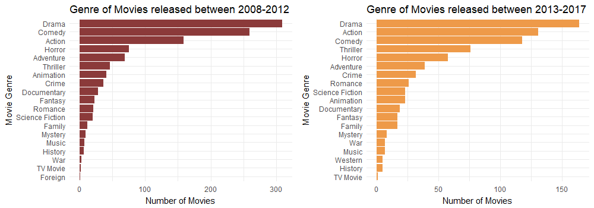
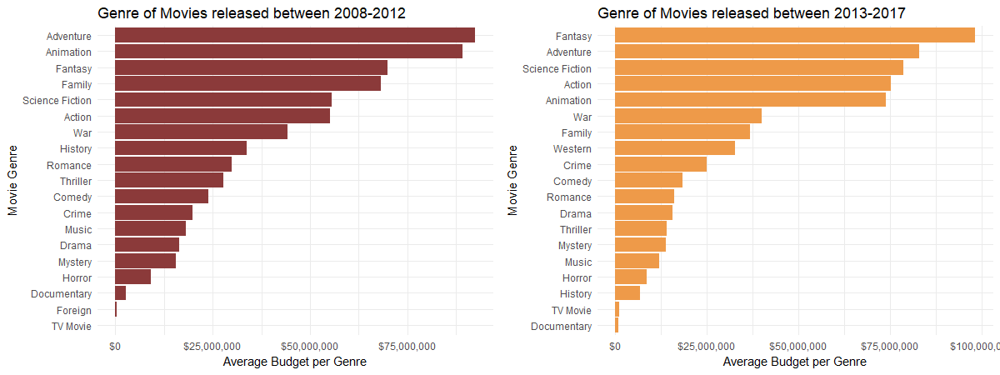
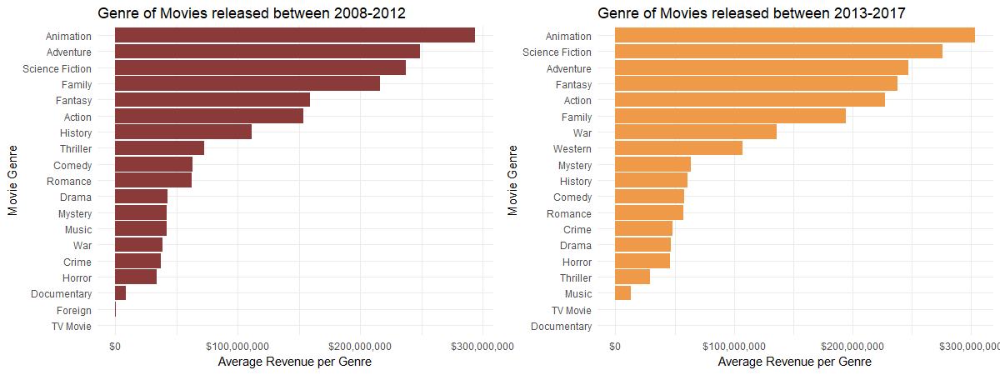

```{r setup, include=FALSE}
knitr::opts_chunk$set(echo = TRUE)
```

# IMDB Movie Dataset Analysis




* *Drama* is still the most frequent genre over the last decade.

* *More thrillers* have released in the last 5 years.

* *More sci-fi* movies in the last 5 years as well.





* *Fantasy* eclipsed *Adventure* in the last 5 years. 

* *Animation* dropped in the last few years, *Science Fiction* gained traction 





* *Animation* generates the most revenue over the last decade.


* *Thriller* movies faced a very significant drop in their earnings in the last 5 years.


